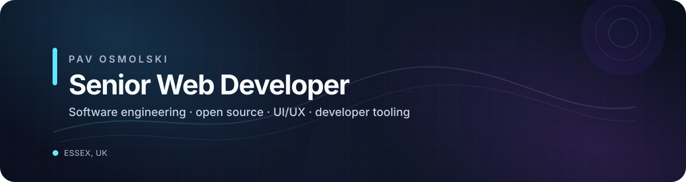
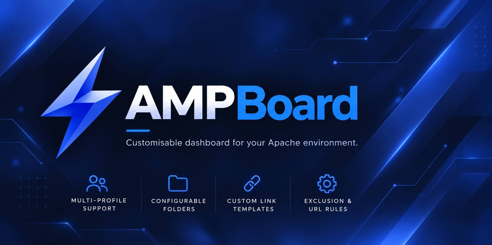
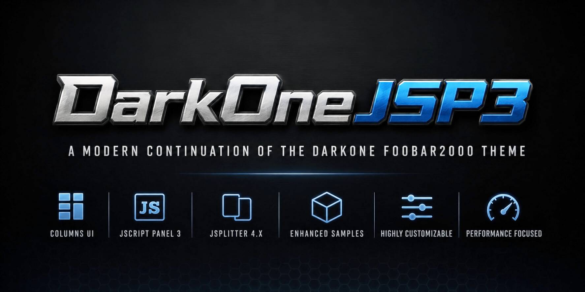
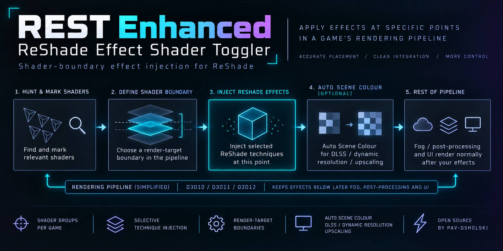
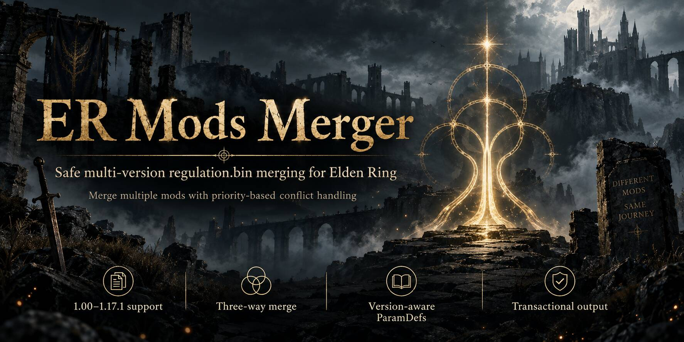

  

  
  

<strong>Web by trade. Open source by habit. Occasionally lost in graphics APIs.</strong>

 

## About me

I'm a UK-based senior developer focused on **front-end engineering, full-stack web development and polished user experiences**. My day-to-day stack centres on JavaScript, React, Vue, PHP, WordPress and the modern web.

Outside conventional web development, I build and maintain open-source software across **developer tooling, audio software, graphics/rendering and game modding**. I particularly enjoy taking complicated systems apart, understanding why they behave the way they do, then making them cleaner, faster and easier to use.

> I tend to gravitate towards projects where engineering, UI/UX and a slightly unreasonable amount of curiosity overlap.

## Toolbox

<table>
<tr>
<td valign="top" width="33%">

**Front end**

`JavaScript` `TypeScript` `React` `Vue`  
`HTML5` `CSS3` `Bootstrap`  
`Accessibility` `Responsive UI`

</td>
<td valign="top" width="33%">

**Back end & CMS**

`PHP` `WordPress` `Laravel`  
`MySQL` `REST APIs`  
`Data integration`

</td>
<td valign="top" width="33%">

**Engineering & tooling**

`C++` `C#` `Git`  
`GitHub Actions` `CI/CD`  
`Direct3D` `Vulkan` `ReShade API`

</td>
</tr>
</table>

## Selected work

<table>
<tr>
<td width="50%" valign="top">

### [AMPBoard](https://github.com/Pav-Osmolski/AMPBoard)

A modern localhost and remote dashboard for **XAMPP, LAMP and MAMP** development environments, with project discovery, live system stats, configuration tools and a responsive administration interface.

**`PHP` `JavaScript` `MySQL` `Apache`**

[View project →](https://github.com/Pav-Osmolski/AMPBoard)

</td>
<td width="50%" valign="top">

### [DarkOneJSP3](https://github.com/Pav-Osmolski/DarkOneJSP3)

A modern x64 continuation of tedGo's **DarkOne foobar2000 theme**, rebuilt around **Columns UI, JScript Panel 3 and JSplitter**, with deeper customisation and modern theme management.

**`JavaScript` `JScript Panel 3` `JSplitter` `UI/UX`**

[View project →](https://github.com/Pav-Osmolski/DarkOneJSP3)

</td>
</tr>

<tr>
<td width="50%" valign="top">

### [ReShade Effect Shader Toggler Enhanced](https://github.com/Pav-Osmolski/ReshadeEffectShaderToggler)

An extensively developed version of **REST for ReShade 6.8+**, with fine-grained rendering-pipeline injection across **Direct3D 11 and Vulkan**, including upscaled paths such as DLSS.

**`C++` `Direct3D 11` `Vulkan` `ReShade API`**

[View project →](https://github.com/Pav-Osmolski/ReshadeEffectShaderToggler)

</td>
<td width="50%" valign="top">

### [ERModsMerger](https://github.com/Pav-Osmolski/ERModsMerger)

A modernised **Elden Ring regulation and CSV parameter merging utility** with version-aware merging, semantic PARAM conflict handling, validation tooling and automated releases.

**`C#` `.NET` `Data processing` `GitHub Actions`**

[View project →](https://github.com/Pav-Osmolski/ERModsMerger)

</td>
</tr>
</table>

## What I care about

- Building interfaces that feel considered, fast and accessible
- Clean component architecture and maintainable front-end systems
- Useful automation rather than automation for its own sake
- Improving mature projects without losing what made them good
- Documentation, validation and release workflows that make software easier to trust
- Open-source work that solves an actual problem

 

### Elsewhere

[**Portfolio**](https://www.pawel-osmolski.com/) · [**LinkedIn**](https://www.linkedin.com/in/pawel-osmolski/) · [**GitHub**](https://github.com/Pav-Osmolski)

Thanks for stopping by. Have a rummage around the repos.

